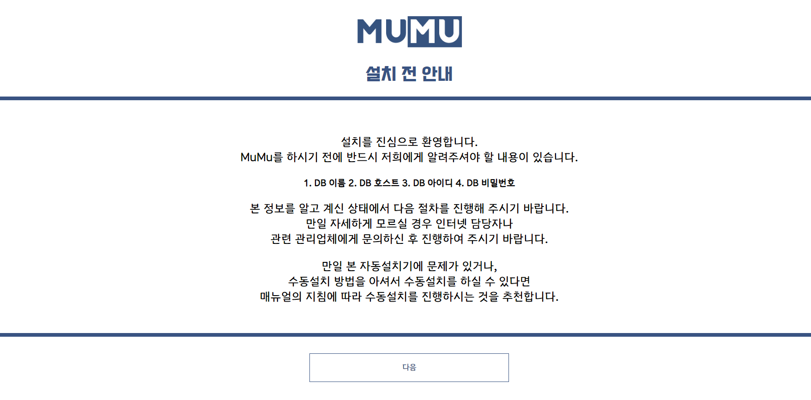
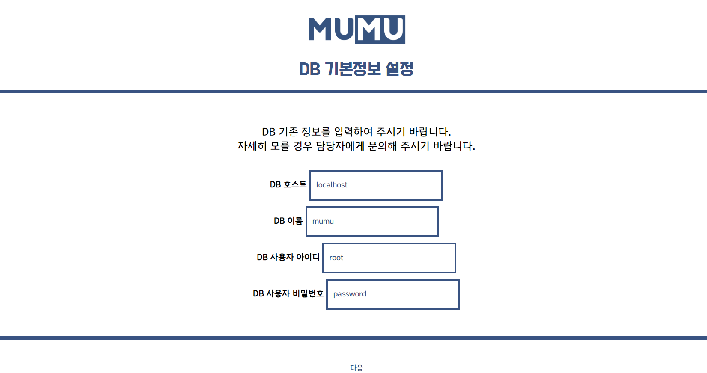
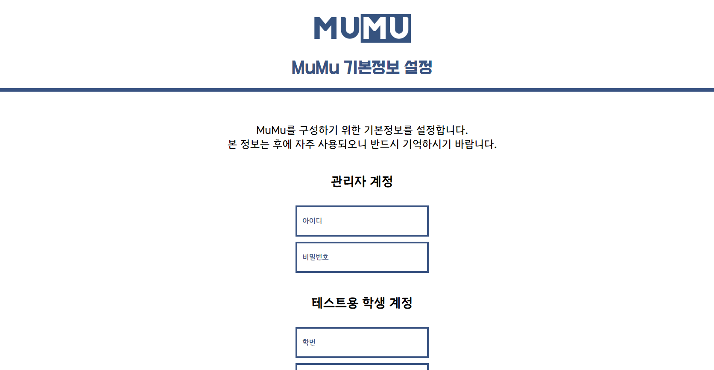

    
    <h1 align="center" style="font-size: 3em;">MuMu Docs</h1>
    

        
        
        
    

    
<b>MuMu</b>는 음악 신청 기능 외에도 많은 기능을 제공합니다. 하지만 이러한 기능을 제대로 활용하기 위해선 제대로 설치하는 것이 중요합니다. 제대로 설치하기 위한 과정은 초보자나 웹 사이트 관련 비 전문가에게 어려울 수 있습니다. 하지만 MuMu는 자동 설치기를 제공합니다. 따라서 다음 지침을 따라서 간편하고 빠른 자동 설치기를 활용해 보시기 바랍니다.

 

## 일러두기

MuMu는 자동 설치기를 제공합니다만 서버의 환경에 따라 제대로 설치되지 않는 경우가 있습니다. 서버 호스팅 업체에서 자동 설치를 권장하지 않는 경우 서버에 무리를 줄 수도 있기에 전문가와 상담하여 자동 설치기를 사용하시기 바랍니다.

또한 자동 설치기에 문제가 생겨 자동으로 설치가 되지 않는다면 DB와 업로드 된 파일을 모두 삭제 후 지침 2을 따라 수동 설치하여 주시기 바랍니다.

## 시작하기

MuMu 저장소에 업로드된 파일을 Zip 등 편한 방법으로 다운받은 후 제공 받은 서버의 html 폴더에 업로드 합니다. 아파치 서버를 사용할 경우 `htdocs` 폴더에 업로드하시기 바랍니다.

## Step.0 설치기 접근하기

MuMu를 설치한 서버에 접근하면 위 사진과 같은 화면이 표시가 됩니다. 화면 속에서 필요하다고 지시하는 "DB 이름", "DB 호스트" 등을 관련 업체에 문의 후 기억해 두시기 바랍니다.

## Step.1 DB 정보 설정하기

다음 화면으로 이동하면 DB 기본정보를 설정하는 화면이 표시됩니다. DB 호스트 등 화면에서 요청하는 정보를 입력합니다. 참고로 DB 호스트는 보통 `localhost`로 설정하시면 무리없이 진행하실 수 있으며 DB 이름과 아이디는 보통 호스팅 업체의 아이디, 비밀번호는 호스팅 업체의 비밀번호입니다.

본 정보는 MuMu 서비스의 전반에 활용되므로 반드시 정확한 정보를 입력하여 주시기 바랍니다. 만일 오타 등으로 잘못 입력하셨을 경우 지침6에 따라 해결하시기 바랍니다.

## Step.2 DB 정보 설정하기

DB 기본정보를 모두 입력하셨다면 MuMu에서 관리자나 학생 계정으로 활용할 수 있는 테스트 계정을 생성할 수 있는 단계입니다. 관리자 계정의 아이디와 비밀번호를 입력하고, 테스트용 학생 계정의 학번과 이름을 입력합니다.

참고로 여기서 생성되는 관리자 계정은 최상위 관리자로서 MuMu 서비스의 모든 상세설정에 접근할 수 있는 권한을 가집니다. 따라서 제 3자에게 유출되지 않도록 주의하여 주시기 바랍니다.

## Step.3 완료하기

모든 설정을 완료하셨다면 이제부터 MuMu를 사용하실 수 있습니다. 만일 정상적으로 설치되지 않았다면 지침2에 따라 초기 상태로 초기화 후 수동 설치하여 주시기 바랍니다.
