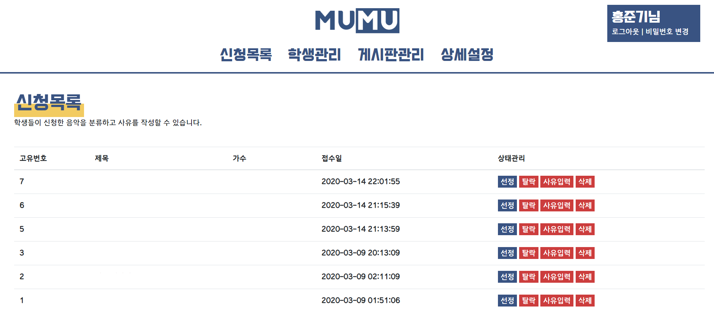
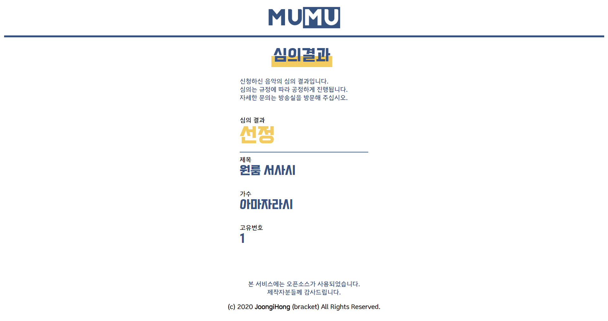
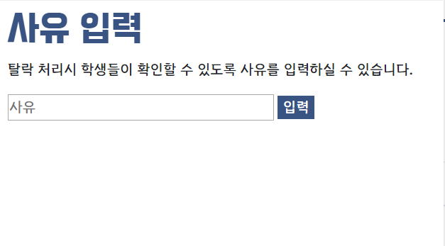
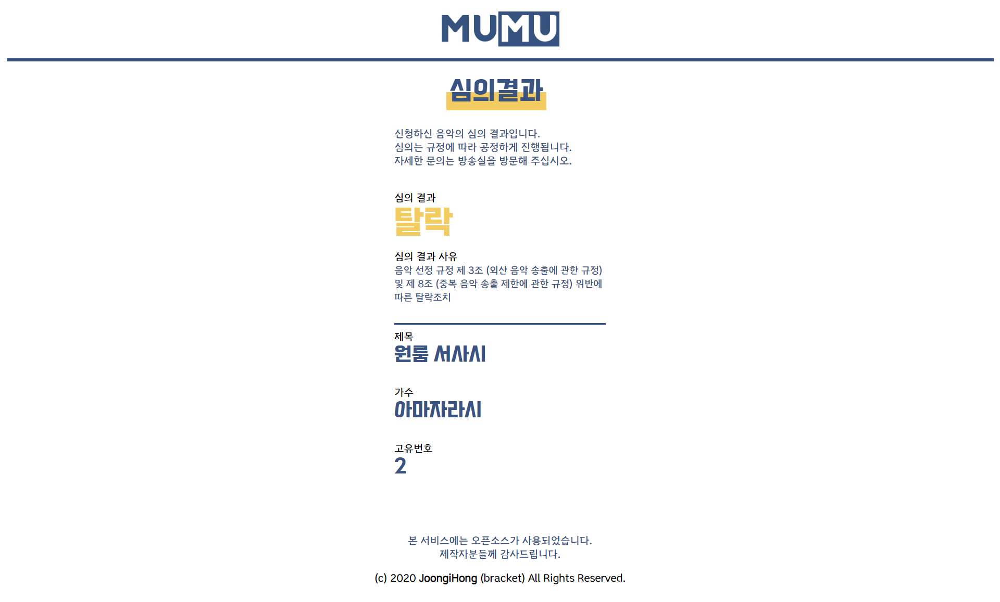

    
    <h1 align="center" style="font-size: 3em;">MuMu Docs</h1>
    

        
        
        
    

    
<b>MuMu</b> 설치를 완료하셨나요? 그렇다면 이제 누구보다 MuMu를 잘 활용하실 때 입니다! 여러가지 기능이 존재하지만 가장 기초적인 기능을 먼저 익혀보도록 하겠습니다. 다음 지침을 따라 기본 기능을 세팅해 보십시오!

 

## 일러두기

MuMu는 성능 개선을 위해 사전 안내 없이 업데이트가 진행될 수 있습니다. 그러한 경우 다음 지침과 현재 MuMu가 제공하는 기능에 차이가 존재할 수 있습니다. 만일 차이가 발생할 경우 본 문서가 업데이트 될 때까지 기다려 주십시오.

_본 문서는 Beta 1 버전에 대응합니다_

## 시작하기

MuMu의 모든 설정은 마스터페이지에서 시작됩니다. `MuMu를 설치한 페이지/master` 에 접근하여 마스터페이지로 접근하십시오.

## Step.0 마스터페이지로 접근하기

마스터페이지에 접근하면 위와 같은 화면이 표시가 됩니다. 설치 당시에 입력한 아이디와 비밀번호를 입력하여 접속하십시오.

## Step.1 음악 신청목록 관리하기

마스터페이지에 접근하면 처음으로 반겨주는 화면이 바로 음악 신청목록 페이지입니다. 본 화면에서는 학생이 신청한 음악을 선정하거나 탈락시킬 수 있으며 탈락 시 사유를 입력할 수 있습니다. 또한 삭제를 눌러 서버의 공간을 확보할 수 있습니다.

### Step.1-1 음악 선정하기

우선 학생이 신청한 음악을 선정하는 방법에 대해 알아보겠습니다. 선정방법은 상태관리 부분에서 `선정`을 클릭하시면 됩니다. 그러면 해당 음악의 제목 색이 파란색으로 변합니다. 그러면 선정이 완료되었습니다.

선정으로 처리할 경우 학생이 확인하는 심의결과 페이지에서는 위와 같이 표시됩니다.

### Step.1-2 음악 탈락 및 사유입력하기

학생이 신청한 음악에 문제가 있는 경우 탈락 처리할 수 있습니다. 탈락 처리 또한 선정과 동일하게 간단합니다. `탈락`을 클릭하면 됩니다. 단 탈락처리에 따른 학생의 반발이 우려되거나 관련 사유를 알려주고 싶은 경우 `사유입력`을 사용하면 됩니다.

탈락 처리가 완료되면 해당 음악의 제목 색이 빨간색으로 변합니다. 그러면 탈락이 완료되었습니다.

사유입력을 클릭하시면 위와 같은 창이 표시됩니다. 사유란에 사유를 입력한 후 입력을 클릭하면 됩니다. 그러면 학생이 확인하는 심의결과 페이지에 표시됩니다.

탈락처리되었으며 사유가 입력된 음악은 조회시 위와 같은 표시됩니다. 단 사유를 입력하지 않은 상태에서 탈락시킬 경우 학생에게 탈락사유는 `심의 중입니다`로 표시됩니다.

## Step.2 학생 관리하기
